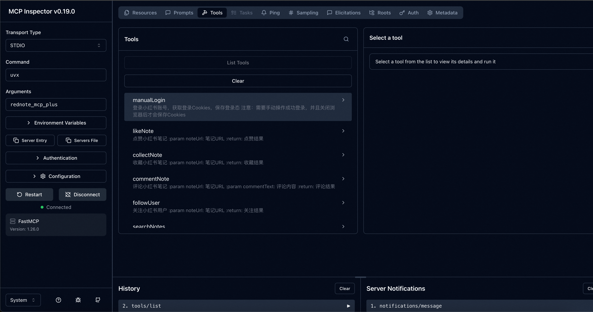
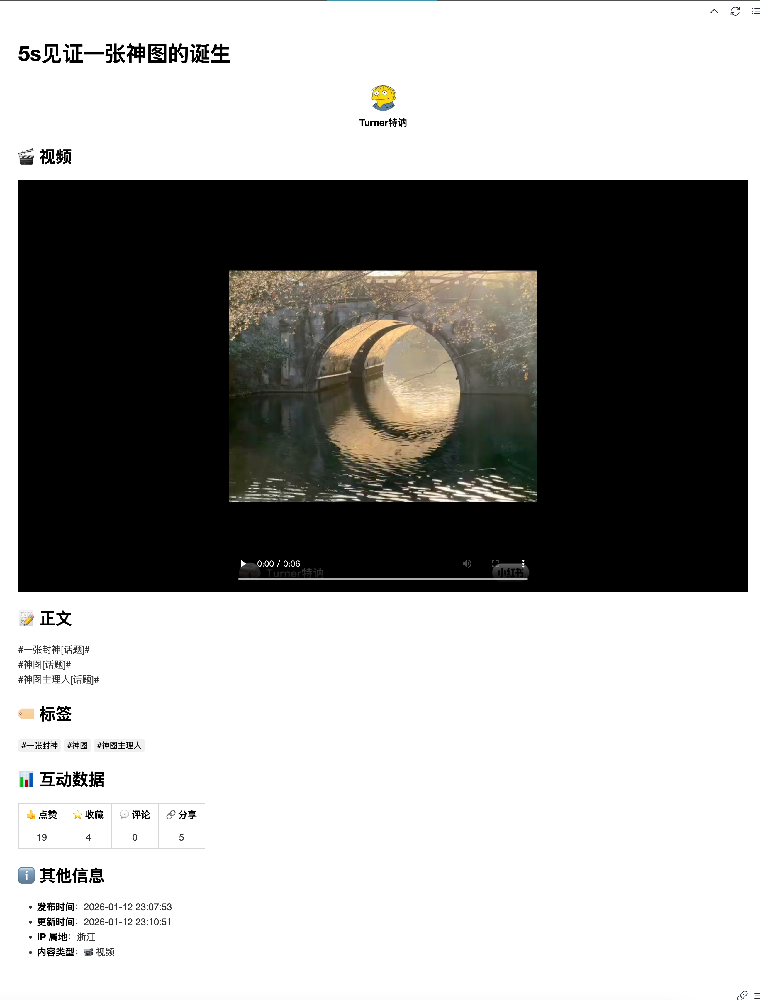

# RedNote-MCP-Plus

<p align="center"></p>

[](docs/README.en.md)
[](README.md)
[](LICENSE)
[](https://badge.fury.io/py/rednote_mcp_plus)

⚙️ MCP server with a more comprehensive suite of tools for RedNote(XiaoHongShu, xhs).

## Key Features
- Easy to Get Started: Experience the tool capabilities with just a few simple commands, no additional configuration required
- Automated Interaction Tools: Includes publishing, liking, bookmarking, commenting, following and other tools to facilitate automated account management
- Automated Scraping Tools: Includes search, note content scraping, user data scraping and other tools to facilitate content discovery

## Tool List
- ✅ Login: Must use this tool to log in to RedNote before using other tools, saves login state
- ❤️ Like: Like any note
- 📥 Bookmark: Bookmark any note
- 💬 Comment: Comment on any note
- 👤 Follow: Follow any user
- 🖼️ Publish Note: Publish any image-text note
- 🔍 Search Notes: Search notes by keyword
- 📖 Note Content Scraping: Save any note in Markdown format
- 📊 User Data Scraping: Get user nickname, bio, tags, interaction information

## Quick Start

If you want to quickly experience the tool capabilities, follow these steps:

### Environment Setup
1. Install uv:
```bash
brew install uv
```

2. Install playwright:
```bash
pip install playwright
playwright install
```

3. Install node:
```bash
brew install node
```

4. Install RedNote MCP
```bash
uv tool install rednote_mcp_plus
```

### Quick Trial

**Start MCP service debugging with one command!**
```bash
npx @modelcontextprotocol/inspector uvx rednote_mcp_plus
```

If everything goes well, you should now see all the tools listed as shown in the image, and you can try out any MCP tools you're interested in!



> ⚠️ **Note:** Please make sure to use the manualLogin tool to log in to RedNote first before trying other tools!

### Demo

The image shows the results of getting note content, including title, author, images/videos, text content, tags, interaction data, publish time, publish location, and other data.



## MCP Server Configuration

Using Cline configuration as an example:

```json
{
  "mcpServers": {
    "RedNote_MCP_Plus": {
      "command": "uvx",
      "args": [
        "rednote_mcp_plus"
      ]
    }
  }
}
```